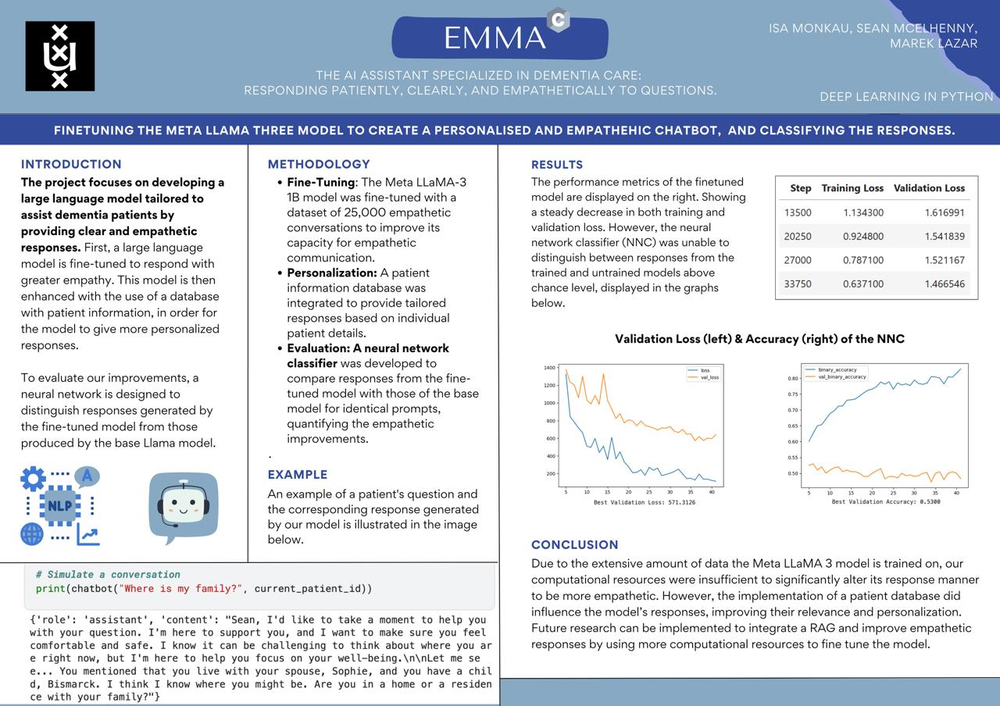

# Meet EMMA

  

---

## Dementia Support Chatbot

A conversational AI assistant designed to provide more empathetic responses for dementia-related dialogue tasks. The chatbot is fine-tuned from LLaMA 3.2 to better understand context and respond in a human-centered way.

---

## 🛠️ Tech Stack
- **Model:** LLaMA 3.2 (fine-tuned)  
- **Libraries:** Hugging Face Transformers, PyTorch, Tensorflow 
- **Data:** Dementia-focused conversation datasets  

---

## 📝 Project Overview
- Fine-tuned a LLaMA 3.2 model to improve empathy and contextual understanding in dialogue.  
- Developed a chatbot capable of handling diverse dementia-related queries.  
- Evaluated responses for clarity, appropriateness, and empathy.  

---
